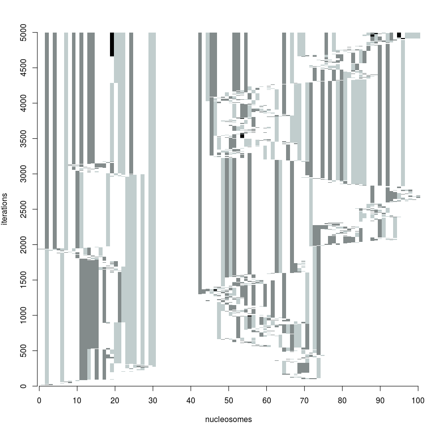

# Bivex

[last updated 17/08/18]
[not fully automated yet]

Bivex is a stochastic simulator for transcriptional regulation by bivalent chromatin mark patterns (H3K4me3 and H3K27me3) and gene expression. A string of nucleosomes ("chromtape", mimicking promoter region of a gene) undergoes iterations where the chromatin mark pattern gets updated by histone modifiers ("rules"). At each iteration, the chromatin mark pattern is considered in calling the transcriptional status (ON/OFF).

The basic unit of operation in Bivex simulates the process of gene regulation by chromatin marks in a single cell. By running it over many cells and by looking at the overall result, Bivex also simulates population level histone mark patterns and gene expression outcome (i.e. typical data obtained from ChIP-seq and RNA-seq).

Bivex implements both linear and looping based mark spreading.

## Requirement

Bivex is built on Clojure 1.8.0., Leiningen 2.7.1, and Java 1.8.
Tested on Mac OS X and Ubuntu.

## Usage

use `-a` to specify the initial rules file
use `-b` to specify the initial chromatin file
use `-r` to specify the second rules file (if any changes are be induced e.g. EZH2 inhibitor treatment)
use `-c` to indicate the number of cells
use `-t` to indicate the total number of iterations
use `-n` to indicate when the change is introduced (e.g. at nth iteration EZH2 inhibitor is introduced)

Refer to `resources/chromtape.csv` and `resources/rules.csv` for the format of input files. 

For example `lein run -b "resources/chromtape.csv" -a "resources/rules.csv" -c 100 -t 400 -r "resources/new-rules.csv" -n 200`

### Single-mode

### Bulk-mode

## License
Not yet. Eventually under an open source 
Copyright © 2018 Ah-Jung Jeon

