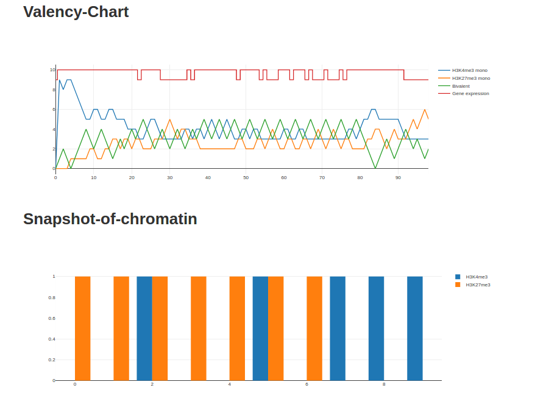
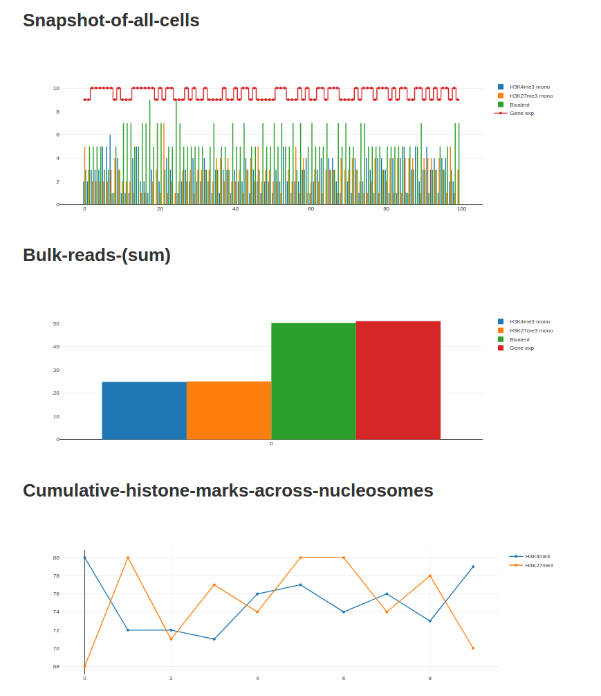

# Bivex

[last updated 06/08/18]

Bivex is a stochastic simulator for transcriptional regulation by bivalent chromatin mark patterns (H3K4me3 and H3K27me3) and gene expression. A string of nucleosomes ("chromtape", mimicking promoter region of a gene) undergoes iterations where the chromatin mark pattern gets updated by histone modifiers ("rules"). At each iteration, the chromatin mark pattern is considered in calling the transcriptional status (ON/OFF).

The basic unit of operation in Bivex simulates the process of gene regulation by chromatin marks in a single cell. By running it over many cells and by looking at the overall result, Bivex also simulates population level histone mark patterns and gene expression outcome (i.e. typical data obtained from ChIP-seq and RNA-seq).

## Requirement

Bivex is built on Clojure 1.8.0., Leiningen 2.7.1, and Java 1.8.
Tested on Mac OS X and Ubuntu.

## Usage

use "-c" to indicate the initial chromtape file
use "-r" to indicate the initial rules file

Refer to resources/chromtape.csv and resources/rules.csv for the format

For a quick look, `lein run -c resources/chromtape.csv -r resources/rules.csv`

### Single-mode

### Bulk-mode

## License
Not yet. Eventually under an open source 

Copyright © 2018 Ah-Jung Jeon

